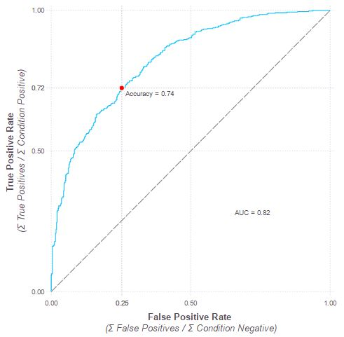
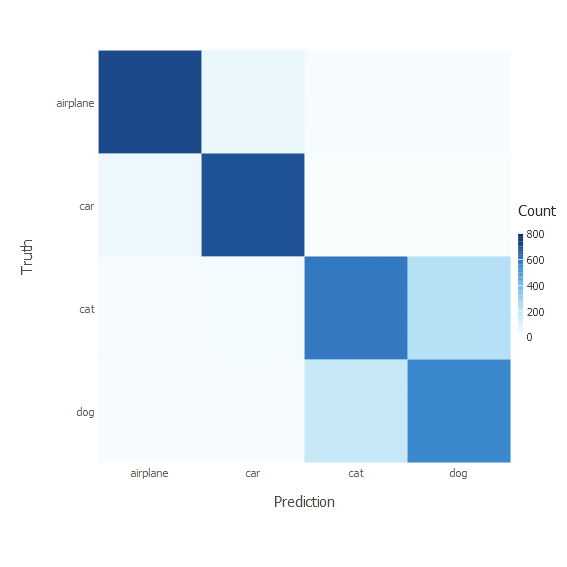

# MLTools.jl
Utilities for Machine Learning

To use, run the command:
```jlcon
Pkg.clone("https://github.com/Wedg/MLTools.jl.git")
```

## ROC Curve
The ROC plot is built with the function:    
- `plot_ROC_curve(y_cond, y_prob)`

  `y_cond` is the "truth" vector with each element either `0` or `1`.  
  `y_prob` is the hypothesis vector with each element a probability in the range `[0, 1]`.
  
As well as the ROC curve of the predictor, the plot shows the model's accuracy, true positive rate, and false positive rate as well as the summary statistic AUC (Area Under Curve).

The plot will look something like this.

  
  
## Confusion Matrix
The confusion matrix plot is built with the function:    
- `plot_confusion_matrix(y_cond, y_pred, "y_label", "x_label", classes)`

  `y_cond` is the "truth" vector with each element one of the labels `1` through `k`.  
  `y_pred` is the model prediction vector with each element one of the labels `1` through `k`.  
  `"y_label"` is the string that will be the label of the y axis.  
  `"x_label"` is the string that will be the label of the x axis.  
  `classes` is a vector of strings representing the classes.
  
An example will hopefully make this clearer. This is taken from the [Alice](https://github.com/Wedg/Alice.jl) package [demo](http://htmlpreview.github.io/?https://github.com/Wedg/Alice.jl/blob/master/demo/stl10/Demo_STL10_B_Convolution_and_Pooling.html) of a reduced STL10 dataset where the classes are one of airplane, car, cat or dog.

See the [demo](http://htmlpreview.github.io/?https://github.com/Wedg/Alice.jl/blob/master/demo/stl10/Demo_STL10_B_Convolution_and_Pooling.html) for more context. The plot is called with the following:
```jlcon
classes = ["airplane", "car", "cat", "dog"]
plot_confusion_matrix(y_cond, y_pred, "Truth", "Prediction", classes)
```

And produces this plot

